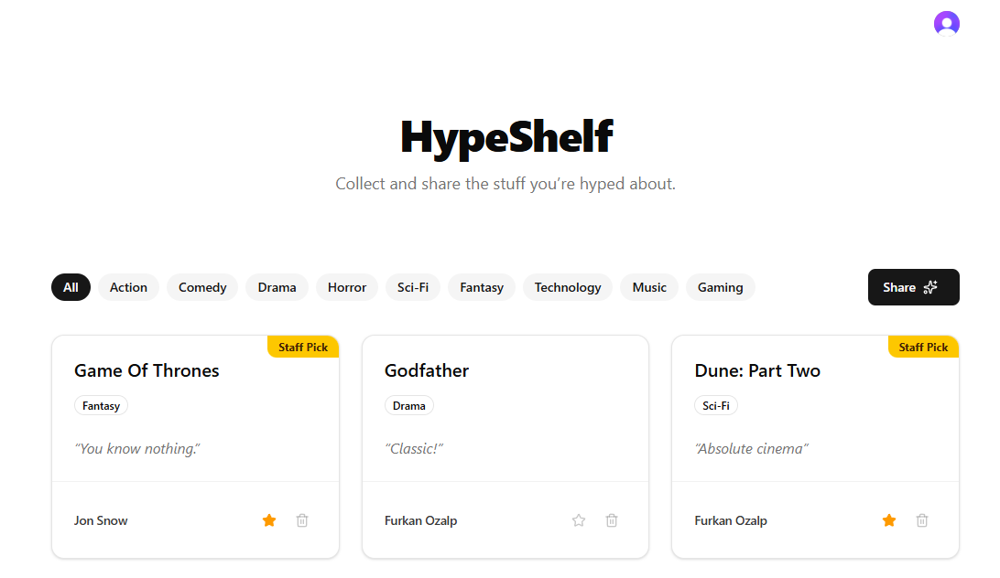

# Hypeshelf



## Run

1. First, install dependencies and build the app:

    ```sh
    npm install && npm run build
    ```

2. Then, run the convex development server:

    ```sh
    npm run convex
    ```

3. Finally, start the app in a separate terminal:

    ```sh
    npm start
    ```

## Access

App: <http://localhost:3000>

Convex: <http://127.0.0.1:6790>

## Testing

> From [Clerk docs](https://clerk.com/docs/guides/development/testing/test-emails-and-phones#email-addresses): Any email with the +clerk_test subaddress is a test email address. No emails will be sent, and they can be verified with the code `424242`. For example: <jane+clerk_test@example.com>

The first signed-up user will get admin privileges. To test with a regular user, sign up with a different email address (i.e., create second account).

## Security

We are using Clerk in keyless mode and Convex in development mode. Secret keys are provided to make development easier, one command to run the app.

In a real world scenario, Clerk would handle authentication (sessions, JWTs, etc.) more securely and Convex would be used in production with a secret key. This is just a demo app to show how the two can work together, so we are not following best practices for security here. I’d also treat every credential and piece of PHI the same way: keep secrets out of source control, scope them to the smallest‑possible deployment (e.g. per‑environment variables, short‑lived tokens), and put the database behind strict access controls.

To summarize, everything related to server must stay on the server. Always double-check authorization logic, and never trust client‑side data.
